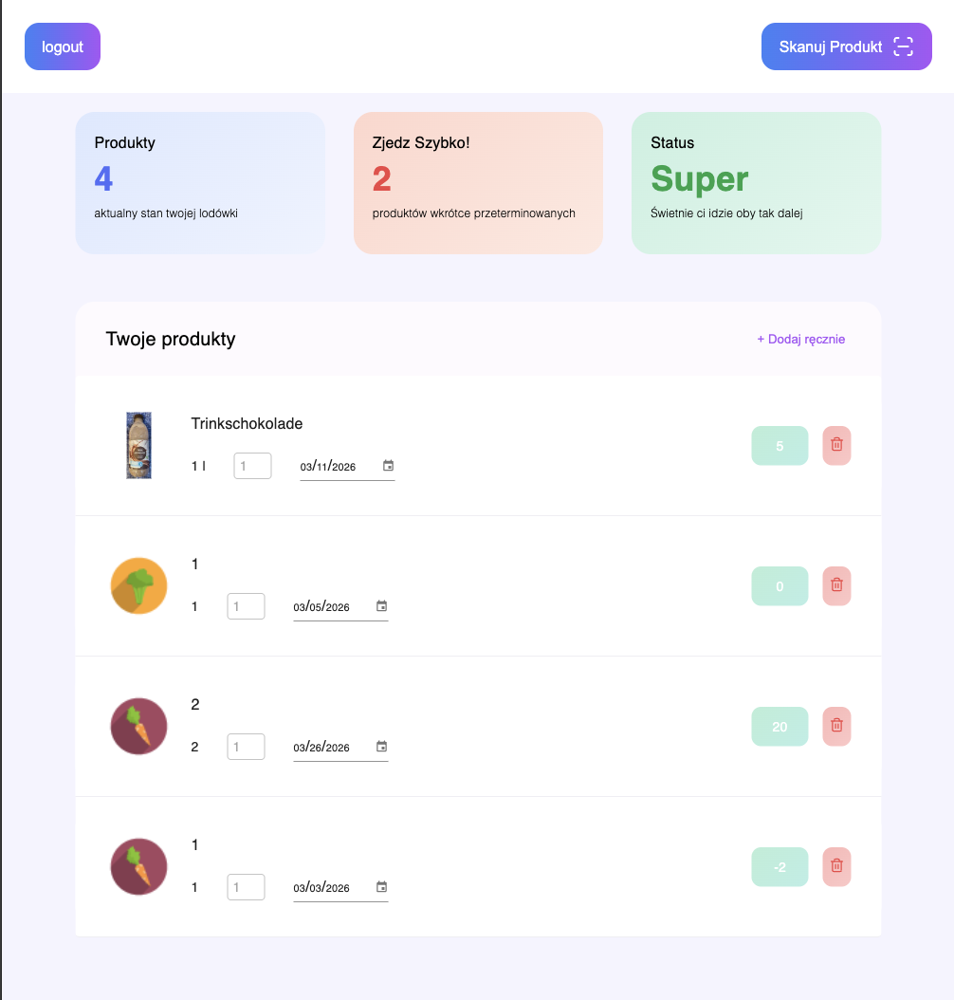

# 🧊 FridgeApp – Smart Fridge Manager

A mobile-friendly web app for tracking food in your fridge. Scan product barcodes, monitor expiry dates, and never waste food again.

---

## 🚀 Live Demo

https://keep-fresh-project.vercel.app/login

---

## 📱 Features

- **EAN Barcode Scanner** – scan any product barcode using your phone camera
- **Automatic Product Data** – fetches product name, image, and nutrition info from Open Food Facts API
- **Expiry Date Tracking** – set and monitor expiry dates with a countdown in days
- **Per-user Storage** – each user has their own private product list stored in Firebase
- **Authentication** – secure login and registration via Firebase Auth
- **Responsive UI** – fully mobile-friendly layout built with Material UI

---

## 🛠 Tech Stack

| Technology          | Purpose                     |
| ------------------- | --------------------------- |
| React + TypeScript  | Frontend framework          |
| Vite                | Build tool                  |
| Material UI (MUI)   | UI component library        |
| Zustand             | Global state management     |
| Firebase Auth       | User authentication         |
| Firebase Firestore  | Cloud database              |
| Open Food Facts API | Product data by EAN barcode |
| React Router        | Client-side routing         |

---

## 🏗 Architecture

```
src/
├── backend/
│   ├── Firebase/        # Firebase config, auth, Firestore services
│   └── globalState/      # Zustand store
├── frontend/
│   └── Components/
│       ├── productCard/      # Individual product display
│       ├── productsContainer/ # Product list
│       ├── scanner/          # EAN barcode scanner
│       ├── navbar/           # Navigation
│       ├── nutritionCard/    # Nutrition info display
│       └── manualAddCard/    # Manual product entry
```

### Data Flow

```
Scan EAN
  → Open Food Facts API (product data)
    → User inputs expiry date
      → Zustand store (local state)
        → Firebase Firestore (persistent storage)
          → Zustand setProducts()
            → UI renders ProductCard
```

---

## ⚙️ Getting Started

### Prerequisites

- Node.js 18+
- Firebase project with Firestore and Authentication enabled

### Installation

```bash
git clone https://github.com/KasperZaw/FridgeApp.git
cd FridgeApp
npm install
```

### Run Locally

```bash
npm run dev
```

### Firebase Firestore Rules

```
rules_version = '2';
service cloud.firestore {
  match /databases/{database}/documents {
    match /Users/{userId}/{document=**} {
      allow read, write: if request.auth != null
                         && request.auth.uid == userId;
    }
  }
}
```

---

## 📸 Screenshots




---

## 👤 Author

**Kacper Zawadzki**  
[GitHub](https://github.com/KasperZaw)
